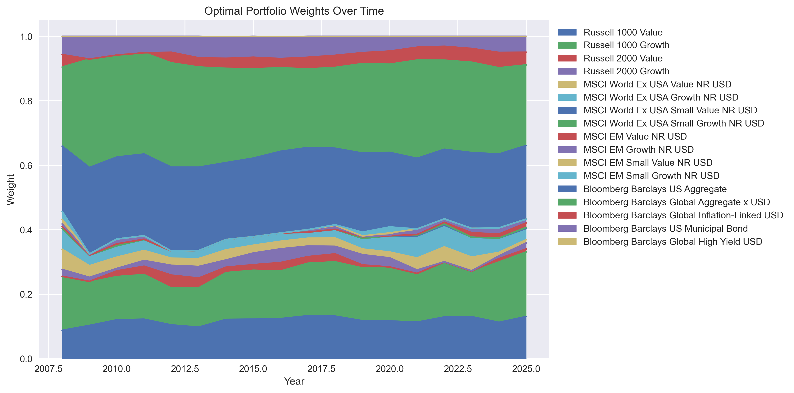
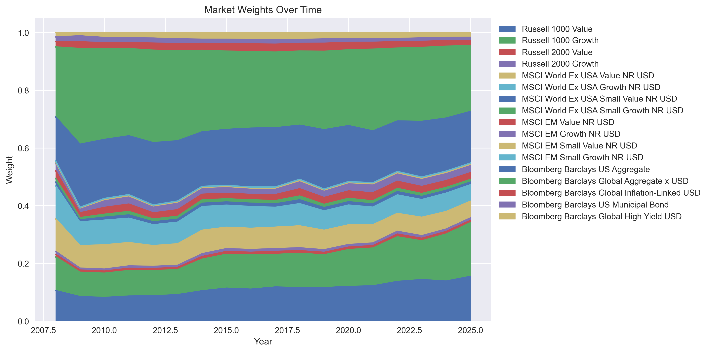
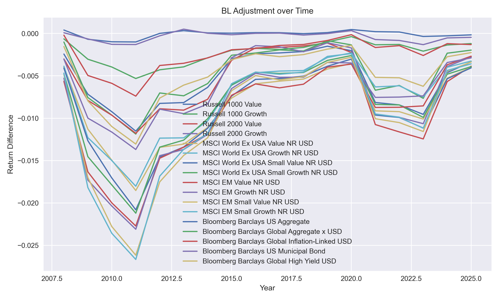
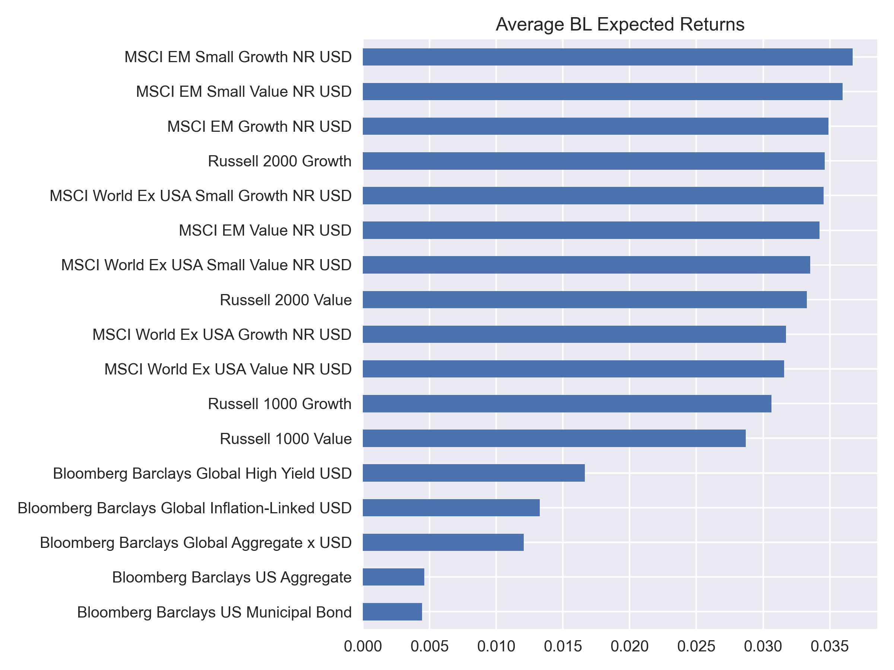
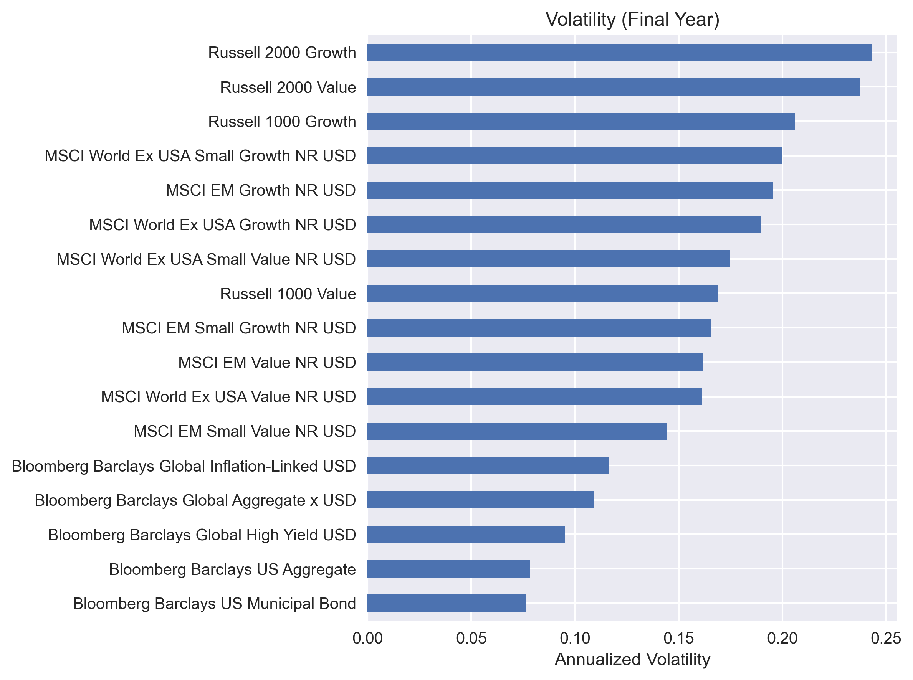
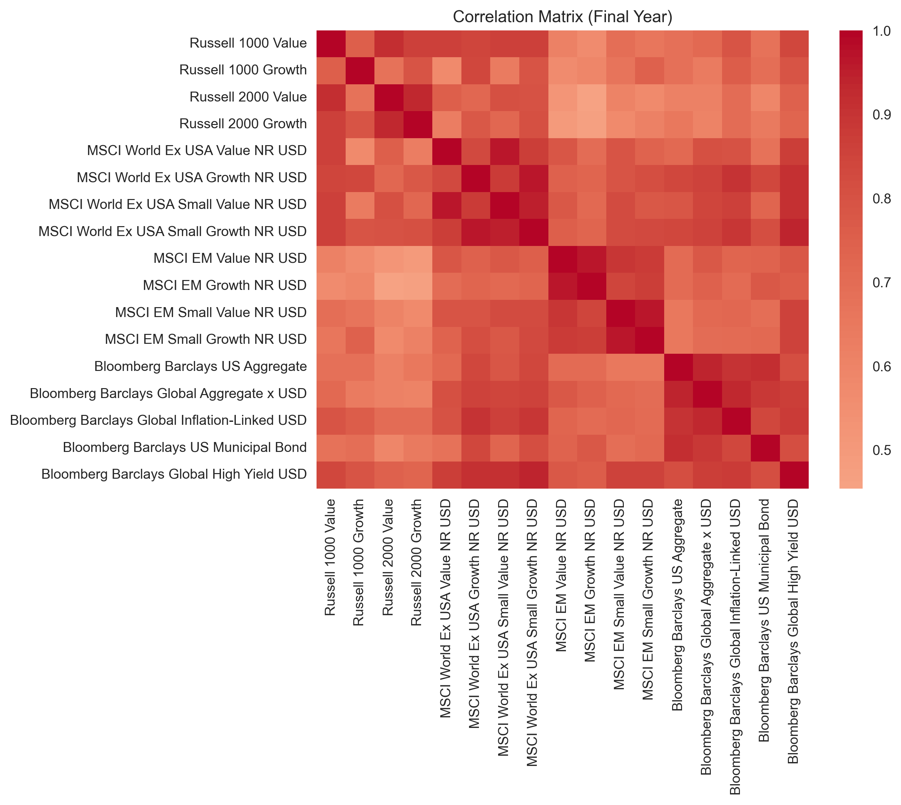

# MATH 5380 — Project 1: Long-Only Multi-Asset Portfolio (Black–Litterman)

This repository contains the programming work for **Project 1** (Columbia MATH 5380): a long-only, multi-asset portfolio with Black–Litterman tilts, annual rebalancing, and a monthly backtest against a market-cap-weighted benchmark.

## Contents

| File | Description |
|------|-------------|
| `project1_multi_asset_bl.ipynb` | Main notebook: data prep, BL views, mean–variance optimization (long-only, ±5% deviation from market weights), backtest, charts, and summary statistics. |
| `build_project1_excel.py` | Python script that reads the course Excel data, reproduces the same model as the notebook, and writes `project1_results.xlsx` with **formulas** for gross/total/active return statistics (see sheet `Data_Monthly`). |
| `project1_results.xlsx` | Generated output (re-run the script after changing the model or data). |
| `Project 1.pdf` | Official assignment instructions (report, Excel, and code requirements). |

## Data

Place **`Data for final project 1.xlsx`** (provided by the instructor) in the **parent** folder of this project, *or* update the path in the notebook and in `build_project1_excel.py` (see `candidates` / `excel_path` logic).

Required sheets: **`Index returns in USD`**, **`Market values in USD`**.

## Environment

- **Python 3.10+** recommended (3.12 used in development).  
- Packages: `pandas`, `numpy`, `scipy`, `matplotlib`, `openpyxl` (for Excel export).  
- A **NumPy 1.26.x** line is often easier with Anaconda binary stacks; NumPy 2.x may require matching wheels for all compiled dependencies.

## Investment Universe

Our investment universe satisfies the diversification requirement by including both equity and fixed-income categories. Specifically, it spans U.S., developed ex-U.S., and emerging-market equities across value, growth, and small-cap styles, as well as several bond sectors including U.S. aggregate, global aggregate, inflation-linked, municipal, and high-yield bonds. For each rebalancing year, benchmark weights are derived from the provided market value dataset.

## Rationale for the Two View Portfolios

Our two views are motivated by a coherent macroeconomic and market-structure narrative.

On the equity side, we impose a mild preference for **U.S. growth equities** over **non-U.S. developed growth equities**. This view reflects the relative depth, liquidity, and information efficiency of the U.S. market, which may provide a structural advantage for U.S. growth stocks compared with their developed ex-U.S. counterparts.

On the fixed-income side, we impose a mild preference for **U.S. aggregate bonds** over **global high-yield bonds**. This reflects a more defensive allocation preference toward higher-quality duration exposure rather than credit-sensitive cyclical beta, especially in an environment where risk repricing and liquidity conditions may matter.

These two views are designed to be **complementary across asset classes**. Instead of concentrating multiple views on the same style dimension, we introduce one view in equities and one view in fixed income, which helps maintain diversification in the source of active bets.

## Covariance Estimation

For each annual rebalancing date, we estimate the covariance matrix of asset returns using the most recent 36 months of prior monthly returns. The sample covariance matrix is annualized by multiplying by 12. This estimation is repeated every year using only information available at the rebalancing date, which avoids look-ahead bias.

Because the full 17×17 covariance matrix is large and changes every year, we report a representative correlation heatmap for one rebalancing year in the main text, while the full yearly matrices are available upon request.


The figure shows strong positive dependence within equity assets and within bond assets, while the dependence across the two major asset classes is lower. This suggests that the covariance matrix captures both common within-class risk and meaningful cross-asset diversification. In addition, Global High Yield bonds appear more closely related to equities than other bond sectors, which is consistent with their higher credit-risk exposure.

## Black–Litterman Expected Return Estimation

For each annual rebalancing date, we estimate expected returns for all assets in the investment universe using the **Black–Litterman model**. This step combines **market-implied equilibrium returns** with our **subjective views** in a disciplined way.

We first compute the **market benchmark weights** from the market value data for each year. Using these benchmark weights and the estimated annualized covariance matrix, we derive the implied equilibrium excess returns:

**$\pi = \delta \Sigma w_{mkt}$**

where $\delta$ is the risk-aversion parameter, $\Sigma$ is the annualized covariance matrix, and $w_{mkt}$ is the vector of market-capitalization benchmark weights.

Next, we introduce two relative view portfolios through the $P$ matrix and the $Q$ vector:

- **View 1:** Russell 1000 Growth will outperform MSCI World Ex USA Growth NR USD  
- **View 2:** Bloomberg Barclays US Aggregate will outperform Bloomberg Barclays Global High Yield USD  

These views are intentionally set to be **mild**, so that the final Black–Litterman expected returns remain close to the market-implied equilibrium returns. This is consistent with the requirement that confidence in the views should be sufficiently weak.

The posterior expected return vector is then computed by blending the equilibrium returns with the views:

**$\mu_{BL} = \left[(\tau \Sigma)^{-1} + P^\top \Omega^{-1} P\right]^{-1}\left[(\tau \Sigma)^{-1}\pi + P^\top \Omega^{-1} Q\right]$**

where $\tau$ controls the uncertainty in the prior equilibrium returns and $\Omega$ represents the uncertainty of the views. In our implementation, the confidence level is kept conservative so that the model only introduces **moderate tilts** away from the benchmark.

The resulting Black–Litterman expected returns are re-estimated **every year** and used as inputs to the portfolio optimization. To satisfy the project requirement, the optimized portfolio is constrained so that each asset’s deviation from the market benchmark weight remains within **$\pm 5\%$**. Therefore, the Black–Litterman model in this project does not produce extreme active bets, but instead generates a controlled and realistic adjustment around the benchmark portfolio.


## Optimize Portfolio Weights
For each rebalance year, we construct the target portfolio using a long-only mean-variance optimization framework. The optimization uses the annualized covariance matrix estimated from the prior 36 months of returns, the Black-Litterman blended expected returns, and the same risk-aversion parameter used in the market-implied return step.

The portfolio is obtained by solving

$$
\min_w \; \frac{1}{2}\delta w^\top \Sigma w - \mu_{BL}^\top w
$$

subject to the following constraints:

- long-only weights ($w_i \ge 0$),
- full investment ($\sum_i w_i = 1$),
- and benchmark-relative bounds so that portfolio weights remain close to benchmark weights (approximately within $\pm 5\%$ when feasible).

This setup keeps the optimized portfolio close to the benchmark while still allowing moderate tilts based on the Black-Litterman expected returns. In our results, the optimized portfolio remains broadly diversified and avoids extreme active bets.


**Figure 4. Benchmark vs. optimized portfolio weights for the final holding year.**  
The optimized portfolio remains close to the benchmark while making moderate reallocations across assets.

## Backtest Your Portfolio
After computing the optimized portfolio weights at each year-end rebalance date, we apply those weights to the monthly asset returns in the following calendar year. This timing ensures that each holding-year portfolio only uses information available up to the prior rebalance date and therefore avoids look-ahead bias.

Using the monthly portfolio and benchmark return series, we evaluate performance through three groups of outputs:

- **Gross Returns**: growth of \$1 invested in the optimized portfolio and in the benchmark,
- **Total Return Statistics**: geometrically annualized return and annualized volatility for both the portfolio and the benchmark,
- **Active Return Statistics**: annualized active return, tracking error, and information ratio relative to the benchmark.

The annual return comparison shows that the optimized portfolio generally tracks the benchmark closely, while still producing moderate year-to-year differences due to the Black-Litterman tilts.


**Figure 5. Annual return comparison between the optimized portfolio and the benchmark.**  
The portfolio generally tracks the benchmark closely, with moderate year-to-year differences driven by the Black-Litterman tilts.

### Backtest Results

#### Total Return Statistics

| Metric | Portfolio | Benchmark |
|---|---:|---:|
| Geometric Annual Return | 4.76% | 4.44% |
| Annualized Volatility | 8.78% | 10.01% |

#### Active Return Statistics

| Metric | Value |
|---|---:|
| Annualized Active Return | 0.19% |
| Tracking Error | 1.71% |
| Information Ratio | 0.11 |

The optimized portfolio slightly outperformed the benchmark over the full backtest period, with a higher geometric annual return and lower annualized volatility. It also produced a positive annualized active return with relatively low tracking error, resulting in a positive information ratio.


## Part 7: Additional Quantities

### Portfolio Weights

**Optimal Portfolio Weights Over Time**



The optimal portfolio shows persistent tilts relative to the market benchmark. In particular, the model tends to overweight growth-oriented equities and underweight certain lower-return segments. These tilts reflect the investor views incorporated through the Black–Litterman framework.

---

**Market Weights Over Time**



Market weights remain relatively stable over time, with equities dominating the allocation and bonds providing diversification. These serve as the baseline benchmark against which the optimal portfolio is constructed.

---

### Black–Litterman Adjustments

**BL Adjustment (BL − π)**



The adjustment plot shows how the Black–Litterman model modifies the market-implied expected returns. The deviations are generally moderate, indicating that the views are incorporated with controlled confidence rather than overwhelming the prior.

---

### Expected Returns

**Average BL Expected Returns**



The average BL expected returns highlight the relative attractiveness of different asset classes after incorporating investor views. Assets with consistently higher adjusted returns receive larger weights in the optimized portfolio.

---

## Part 8: Risk Analysis (Final Year)

### Volatility (Final Year)



The volatility comparison shows clear differences across asset classes. Equity segments, especially small-cap and emerging markets, exhibit higher risk, while fixed income assets such as US Aggregate bonds display significantly lower volatility.

---

### Correlation Matrix



The correlation matrix illustrates the dependence structure across assets. Equities tend to be positively correlated with each other, while bonds show lower or even negative correlations with equities, providing diversification benefits in the portfolio construction.


## How to run

1. **Notebook**  
   Open `project1_multi_asset_bl.ipynb` in Jupyter or VS Code, select your conda/virtual environment, then run all cells from the top (after pointing to the data file if needed).

2. **Excel workbook** (from the project root directory)  
   ```bash
   python build_project1_excel.py
   ```  
   This overwrites or creates `project1_results.xlsx`. Close the file in Excel if you see a permission error.

## Model summary (for orientation)

- **Universe:** intersection of return columns and market-value columns; names aligned to the returns file (see notebook name mapping).  
- **Views:** two relative-return views (see notebook section “参数与观点”); `P`, `Q`, and BL parameters `tau`, `omega_scale` are set there.  
- **Each year:** 36+ months of history up to the rebalance date → annualized covariance → implied `π` → Black–Litterman `μ_BL` → optimal weights with **Σ**, **μ_BL**, and the same risk-aversion as in `π`.  
- **Benchmark in code and in Excel:** within each **calendar year of performance**, the benchmark uses the **year-end market weights** chosen at the prior year’s rebalance (constant for that year’s months). The course PDF also describes an alternative “prior-month cap weights × current returns”; if you use that, document it consistently in the report.  
- **No look-ahead:** estimation window ends on or before the rebalance date; the performance year is strictly after that date (assertions in the notebook loop).

## Submission (per `Project 1.pdf`)

The course requires a **short report (≤5 pages)**, a **spreadsheet** with key results and **formulas**, and **code**. This repo supplies the code and a template Excel builder; the written report is separate.

## License / use

Course project use only; data files are property of the instructor.
